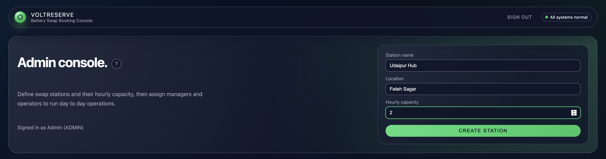
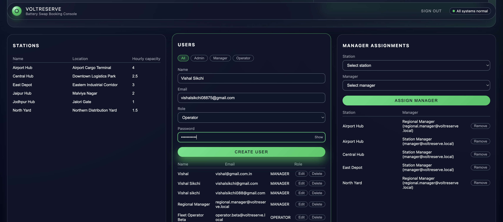
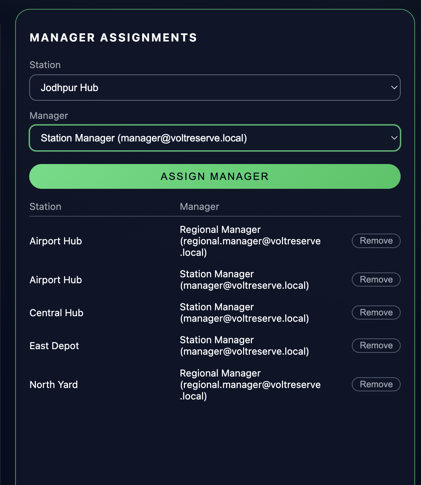
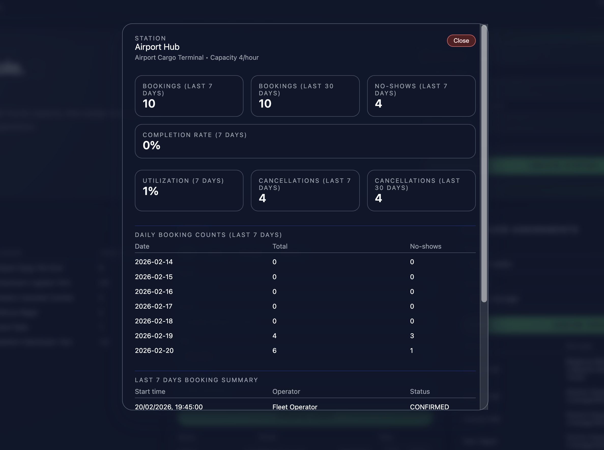

## VoltReserve Admin Panel Guide

This guide explains how to use the VoltReserve admin console and how the station metrics are calculated.

---

### Accessing the admin console

- Sign in as a user with the `ADMIN` role.
- Open the `/admin` route in your browser.
- You will see:
  - A header showing your signed-in admin account.
  - A form to create new swap stations.
  - Three main cards:
    - Stations
    - Users
    - Manager assignments

You can always open this guide from the **?** help button next to the "Admin console." title.

---

### Overview screenshot

The screenshot below shows the admin console with the station metrics popup open.

---

### Stations card

- Lists all swap stations with:
  - Name
  - Location
  - Hourly capacity (number of vehicles per hour)
- Click any station row to open the **Station metrics** popup for that station.

To create a new station:

- Fill in the station name.
- Enter a human-readable location.
- Set the hourly capacity (for example, `4` means 4 swaps per hour).
- Click **Create station**.

---

### Users card

- Shows all users in the system.
- Use the role tabs (All, Admin, Manager, Operator) to filter.
- Create a new user:
  - Enter name, email, role, and an initial password.
  - The password must meet the strength rules shown in the form.
- Edit a user:
  - Click **Edit**, update fields, and save.
- Delete a user:
  - Click **Delete** next to the user row.

If you assign the **MANAGER** role to a user, they can be selected in the Manager assignments card.

---

### Manager assignments card

- Assign managers to stations so they can operate specific locations.
- To assign:
  - Select a station.
  - Select a manager.
  - Click **Assign manager**.
- Existing assignments are listed below with a **Remove** button to unassign a manager from a station.

---

### Station metrics popup

Clicking a station row in the **Stations** card opens a popup with detailed metrics:

- Station details:
  - Name
  - Location
  - Hourly capacity
- Summary metrics:
  - Bookings (last 7 days)
  - Bookings (last 30 days)
  - No-shows (last 7 days)
  - Completion rate (7 days)
  - Utilization (7 days)
  - Cancellations (last 7 days and last 30 days)
- Daily booking counts (last 7 days)
- Last 7 days booking summary table with:
  - Start time
  - Operator
  - Status

Use the red **Close** button in the top-right corner of the popup to return to the main admin view.

---

### Booking statuses

Each booking can have one of several statuses:

- `CONFIRMED` – a future booking that has been scheduled.
- `COMPLETED` – a booking that was successfully completed.
- `NO_SHOW` – the operator did not arrive before the arrival deadline.
- `CANCELLED` – the booking was cancelled by the operator.

The metrics focus primarily on `COMPLETED`, `NO_SHOW`, and `CANCELLED` bookings.

---

### Time windows used for metrics

The backend calculates metrics using UTC timestamps:

- **Now**: the current UTC time.
- **7-day window**:
  - `windowStart = now - 7 days`
  - `windowEnd = now`
- **30-day window**:
  - `monthStart = now - 30 days`
  - `monthEnd = now`

Only bookings whose `slot_start_utc` falls between these boundaries are included.

---

### Metrics logic and algorithms

All metrics are calculated **per station** using the booking records in the database.

#### 1. Total bookings per station (weekly/monthly)

- For a given station:
  - Count all bookings in the 7-day window.
  - Group them by `status`.
  - Sum all counts to get the total number of bookings.
- The same logic is repeated for the 30-day window.

Formula:

- `weekly.total = sum(count(status) for all statuses in last 7 days)`
- `monthly.total = sum(count(status) for all statuses in last 30 days)`

#### 2. Total no-shows per station

- For a given station:
  - Count all bookings with `status = 'NO_SHOW'` in the chosen window.

Formulas:

- `weekly.noShows = weekly.byStatus.NO_SHOW`
- `monthly.noShows = monthly.byStatus.NO_SHOW`

#### 3. Daily booking counts (last 7 days)

- For each booking in the last 7 days:
  - Take the date part of `slot_start_utc` (YYYY-MM-DD).
  - Group bookings by this date.
  - For each date, count:
    - Total bookings
    - Completed bookings
    - No-shows
    - Cancellations
- Generate a row for each of the last 7 days, even if there were zero bookings.

This produces a 7-row table with per-day statistics.

#### 4. Completion rate

Completion rate focuses on outcomes where the operator had a chance to arrive:

- Consider only bookings that ended as `COMPLETED` or `NO_SHOW`.
- Ignore cancelled bookings for this rate, because they were intentionally cancelled.

Formula:

- `observed = completed + noShow`
- If `observed = 0`, completion rate is defined as `0`.
- Otherwise:  
  `completionRate = completed / observed`

The popup displays this as a percentage:

- `completionRatePercent = round(completionRate * 100)`

#### 5. Utilization percentage

Utilization compares how many bookings actually used the station versus its theoretical capacity.

- For each station, the configured `hourly_capacity` represents how many bookings can be handled per hour.
- The system assumes 24 hours per day for capacity calculations.

Steps:

- `capacityPerDay = hourly_capacity * 24`
- `weeklyCapacity = capacityPerDay * 7`
- `usedForUtilization = completed + noShow` (bookings that occupied capacity)
- If `weeklyCapacity = 0`, utilization is `0`.
- Otherwise:  
  `utilizationPercent = usedForUtilization / weeklyCapacity`

The popup shows:

- `round(utilizationPercent * 100)` as a percentage.

#### 6. Cancellation trends

Cancellation trends look at how often bookings are cancelled.

- For a given station:
  - Count bookings with `status = 'CANCELLED'` in the last 7 days.
  - Count bookings with `status = 'CANCELLED'` in the last 30 days.
- These counts are displayed as:
  - `Cancellations (last 7 days)`
  - `Cancellations (last 30 days)`

Daily cancellation counts are also included in the daily stats table.

---

### Practical interpretation tips

- **High completion rate** with **low no-shows**:
  - Operations are running smoothly, and operators arrive on time.
- **High no-shows**:
  - Consider adjusting scheduling, reminders, or grace periods.
- **Low utilization** with low no-shows:
  - The station has spare capacity; you can route more demand here.
- **High cancellations**:
  - Investigate whether booking windows, pricing, or routing are causing plans to change often.

---

### Getting help

- Click the **?** help button on the admin console header to open this guide.
- Share this page with new admins as a quick onboarding resource.
