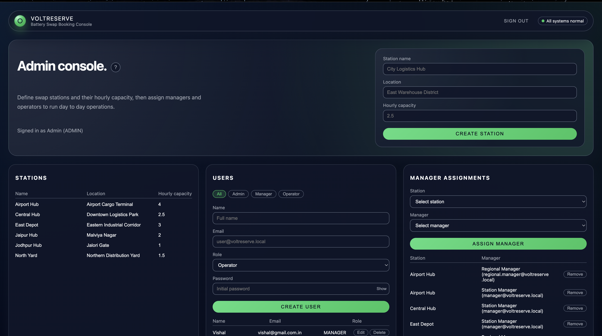

## VoltReserve Manager Panel Guide

This guide explains how to use the VoltReserve manager console and how to interpret the station-level booking and capacity information.

---

### Accessing the manager console

- Sign in as a user with the `MANAGER` role.
- Open the `/manager` route in your browser.
- You will see:
  - A header showing your signed-in manager account.
  - An **Assigned stations** card.
  - A **Capacity outlook (24h)** card.
  - An **Upcoming bookings** card.
  - A **7-day booking stats** card.

You can always open this guide from the **?** help button next to the "Manager console." title.

---

### Manager console overview

The manager console is designed to answer three questions:

- Which stations am I responsible for?
- How busy are those stations over the next 24 hours?
- What has actually happened at the station in the last 7 days?

The screenshot below shows the manager console with capacity and booking stats visible.

> Replace this screenshot path with a manager-specific image (for example `manager/manager-console-overview.png`) when available.

---

### Assigned stations card

The **Assigned stations** card lists all stations that have been assigned to the signed-in manager.

- Columns:
  - **Name** – station name.
  - **Location** – human-readable location label.
  - **Hourly capacity** – configured `hourly_capacity` for the station.
- Selecting a station:
  - Click any row to highlight it.
  - All other cards on the page (capacity, bookings, stats) update to that station.

If no stations are assigned, the card shows a message instead of a table.

---

### Capacity outlook (24h) card

The **Capacity outlook (24h)** card shows how busy a station is over the next 24 hours, broken down into 15‑minute slots.

- Before selecting a station:
  - The card asks you to select a station.
- After selecting a station:
  - Slots between **now** and **now + 24 hours** are loaded from the backend.
  - Slots are grouped by **date**:
    - Each day is shown with a date label (for example `2026-02-21`).
    - Under each date, you see all 15‑minute slots for that day.
  - Each slot pill shows:
    - Local time label (for example `02:30 PM`).
    - Usage label: `used / max` (for example `3/4 used`).
  - Slots that are close to full capacity are highlighted to help you spot tight periods.

Use this card to:

- See when a station is likely to be congested.
- Identify quieter windows where additional bookings could be routed.

---

### Upcoming bookings card

The **Upcoming bookings** card lists future bookings at the selected station.

- Before selecting a station:
  - The card asks you to select a station.
- After selecting a station:
  - If there are no upcoming bookings, you see a short message.
  - Otherwise, a table is shown with:
    - **Operator** – operator name.
    - **Start** – local start date and time.
    - **Status** – colored status icon.
    - **Actions** – contextual actions that the manager can perform.

#### Status legend

Above the table you will see a legend for status icons:

- Green filled circle – `CONFIRMED`
- Blue filled circle – `COMPLETED`
- Red filled circle – `NO_SHOW`
- Grey circle – `CANCELLED`

You can hover any icon to see a tooltip with the full text status.

#### Marking a booking as completed

Managers can mark a booking as **completed** when the swap has actually taken place.

- For an upcoming booking:
  - A **Mark completed** button appears when the start time is close (within the allowed time window).
  - Clicking the button:
    - Calls the manager API to update the booking status to `COMPLETED`.
    - Refreshes the **Upcoming bookings** list.
    - Refreshes the **7-day booking stats** card so metrics stay up to date.

Use this action once the vehicle has finished the swap session at the station.

---

### 7-day booking stats card

The **7-day booking stats** card summarises recent activity at the selected station.

When a station is selected and there is data:

- Summary metrics:
  - **Total bookings** – total bookings in the last 7 days.
  - Breakdown by status (counts of `CONFIRMED`, `COMPLETED`, `NO_SHOW`).
  - **No-show rate** – percentage of bookings that ended as `NO_SHOW`.
- Status legend:
  - Uses the same colored icons as **Upcoming bookings**.
  - Lets you quickly interpret the status column in the recent bookings table.
- Recent bookings table:
  - Shows bookings from the last 7 days for the station.
  - Columns:
    - **Operator** – operator name.
    - **Start** – local start date and time.
    - **Status** – colored status icon.

If there are no bookings in the last 7 days, the card shows a simple message instead of a table.

---

### Status icons and lifecycle

Across the manager console, booking statuses use the same meaning as in the operator and admin views:

- `CONFIRMED` – booking is scheduled for a future time.
- `COMPLETED` – booking was successfully completed at the station.
- `NO_SHOW` – the operator did not arrive before the arrival deadline.
- `CANCELLED` – the booking was cancelled before it started.

From the manager perspective:

- Marking a booking as completed moves it from `CONFIRMED` to `COMPLETED`.
- No-show and cancellation statuses usually come from automated processes or operator actions.

These statuses feed into utilisation and reliability metrics visible in the admin console.

---

### Capacity and utilisation intuition

When reviewing the manager console:

- Look for periods where many slots are close to fully used:
  - This indicates peaks where station staff need to be ready for higher throughput.
- Watch the balance of `COMPLETED` vs `NO_SHOW` bookings:
  - High no-show rates may suggest that schedules or arrival expectations need adjustment.
- Combine the **Capacity outlook (24h)** with **7-day booking stats**:
  - Use recent patterns to plan staffing and operational decisions for the upcoming day.

---

### Practical tips for managers

- Use **Assigned stations** to quickly switch context between locations.
- Keep the **Capacity outlook (24h)** card open during operations:
  - It reveals the near-term load on the station.
- Regularly check **Upcoming bookings**:
  - Confirm that there are no unexpected gaps or overloads at key times.
- Review the **7-day booking stats** at the end of each shift:
  - Track completion rates and no-show trends.

---

### Getting help

- Click the **?** help button on the manager console header to open this guide.
- Share this page with new managers as a quick onboarding resource.

